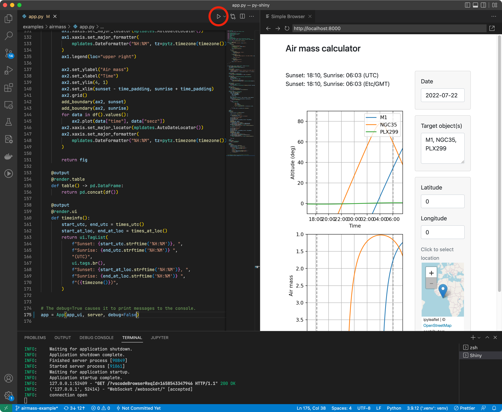

# Shiny for Python

This is an extension to help launch [Shiny for Python](https://shiny.rstudio.com/py/) applications. Shiny is a Python package that is designed to make it easy to build interactive web applications with the power of Python’s data and scientific stack.

## Features

The main feature of this extension is the addition of a "Run Shiny App" option to the Run button when an app.py is being edited. 

It also provides a couple of Python snippets:

* `shinyapp` for creating a new Shiny application
* `shinymod` for creating a new Shiny module

See [the docs](https://shiny.rstudio.com/py/docs/install.html#configure-visual-studio-code) for more information, including instructions for configuring the type checker and debugger for use with Shiny.

## Extension Settings

This extension contributes the following settings:

- `shiny.python.port`: The port number to listen on when running a Shiny app. By default, 8000.
